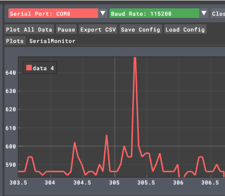

# Adaptive IoT Sampling with FFT, MQTT, and LoRaWAN

**Version:** 1.0  
**Updated:** April 15, 2025  
**Board:** Heltec ESP32 V3

---

## Project Summary

This project is an ESP32-based IoT application that:
- Dynamically samples a sensor (or synthetic signal) using an FFT to determine the optimal sampling frequency.
- Aggregates sensor data over a specified time window.
- Transmits aggregated metrics via MQTT (over WiFi) and LoRaWAN (for long-range, low-power communication).
- Evaluates performance metrics including end-to-end latency and data volume.
- Optionally implements deep sleep to reduce power consumption.

This README serves as a detailed walkthrough of the system, describing code organization, system architecture, and how to set up and run the solution.

---

## Table of Contents

1. [System Overview](#system-overview)
2. [Architecture & Key Components](#architecture--key-components)
   - [Tasks](#tasks)
   - [Shared Resources and Synchronization](#shared-resources-and-synchronization)
   - [RTC Memory for State Persistence](#rtc-memory-for-state-persistence)
3. [Code Review and Walkthrough](#code-review-and-walkthrough)
4. [Setup Instructions](#setup-instructions)
   - [Hardware and Software Prerequisites](#hardware-and-software-prerequisites)
   - [Step-by-Step Setup](#step-by-step-setup)
5. [Performance Evaluation](#performance-evaluation)
6. [Troubleshooting and Additional Notes](#troubleshooting-and-additional-notes)
7. [License](#license)
8. [Acknowledgments](#acknowledgments)

---

## System Overview

The application runs on an ESP32 (Heltec ESP32 V3) and uses FreeRTOS to manage concurrent tasks across the dual cores. The main operational phases of the system are:

1. **Initialization:**  
   The board boots up, initializes WiFi, MQTT, LoRaWAN, and FreeRTOS primitives, and performs a maximum-sampling test to measure the device’s capability.

2. **Processing:**  
   - **Sampling:** The system collects sensor (or generated) data into a buffer.  
   - **FFT Analysis:** Once the buffer fills, an FFT task computes the dominant frequency and adapts the sampling frequency using the Nyquist criterion.  
   - **Aggregation:** Over a fixed window (e.g., 5 seconds), the system computes statistical metrics (mean, median, MSE) of the sensor data.
   - **Communication:** The aggregated data are transmitted via MQTT and also prepared for LoRaWAN.

3. **Evaluation:**  
   The system logs performance metrics such as end-to-end latency (from sampling to MQTT publish) and calculates the total bytes transmitted over MQTT.

4. **(Optional) Power Save Mode:**  
   The device may enter deep sleep between cycles to significantly reduce energy consumption, preserving critical state in RTC memory.

---

## Architecture & Key Components

### Tasks

- **Sampling Task:**  
  Collects samples based on the current sampling rate, updates the aggregate sum, and triggers FFT when the buffer is full.

- **FFT Task:**  
  Processes the sample buffer using FFT to determine the dominant frequency and then adjusts the sampling frequency accordingly.

- **Averaging Task:**  
  Computes the average (and other statistics) over a 5-second window, calculates latency, and publishes data over MQTT and prepares LoRaWAN payload.

- **LoRaWAN State Machine (in loop):**  
  Manages joining, sending, cycling, and sleeping states as per the Heltec LoRaWAN API.

### Shared Resources and Synchronization

- **Buffers & Global Variables:**  
  The sample buffer, aggregate sums, and timing variables are shared among tasks.  
- **Mutexes & Semaphores:**  
  - `dataMutex` protects the sample buffer and sample index.  
  - `aggregateMutex` protects the aggregate values.  
  - `timingMutex` synchronizes modifications to timing parameters (dt and samplingFrequency).

### RTC Memory for State Persistence

Certain variables critical to system operation (e.g., `cycle_count`, `mqtt_bytes_sent_total`, `total_latency_us`, and `latency_count`) are declared with `RTC_DATA_ATTR` so that their values persist through deep sleep cycles.

---

## Code Review and Walkthrough

This section explains the functionality and design choices of the main components of the code without reproducing the full source. The following is a breakdown of each module and its role in the system:

### 1. WiFi and MQTT Connectivity
- **Purpose:**  
  Establish and maintain the network connection.
- **Key Functions:**  
  - `ensureWiFiConnection()`: Checks whether the ESP32 is connected to WiFi; if not, it disconnects any stale connection and reconnects.
  - `ensureMQTTConnection()`: Attempts to connect to the MQTT broker repeatedly until successful.
- **Design Rationale:**  
  Using blocking loops and delays ensures that the device reliably connects to your network and MQTT broker before proceeding with sensor tasks.

### 2. Adaptive Sampling and FFT Analysis
- **Sampling Task:**  
  - **Role:** Continuously generates (or collects) sensor data using a simulated signal (or actual sensor input) and stores the data in a buffer.
  - **Mechanism:**  
    - Increments a logical time variable `t` using a dynamically determined time step `dt`.
    - Updates a running sum and count for later aggregation.
    - Notifies the FFT task when the sample buffer is full.
- **FFT Task:**  
  - **Role:** Processes the filled sample buffer to compute the FFT.
  - **Mechanism:**  
    - Applies a Hamming window to the data before computing the FFT.
    - Determines the dominant frequency by searching for the highest magnitude in the FFT result.
    - Updates the sampling frequency (using the Nyquist criterion: approximately 2× the dominant frequency) and adjusts the time increment `dt` accordingly.
    - Locks the adaptive frequency when successive FFT cycles show a stable dominant frequency.
- **Design Rationale:**  
  This adaptive approach minimizes oversampling and helps in conserving computational resources and energy by aligning the sampling rate with the signal characteristics.

### 3. Data Aggregation and Evaluation
- **Averaging Task:**  
  - **Role:** Calculates statistics (average, and potentially median, MSE, etc.) over a fixed time window.
  - **Mechanism:**  
    - Aggregates the sum of the samples and counts the total number collected over the window.
    - Computes the average value and prints this value along with the number of samples used.
- **Performance Metrics:**  
  - **Latency Measurement:**  
    - Timestamps are captured at the beginning of the sampling cycle and just before publishing via MQTT.
    - The latency (in microseconds) is computed as the difference between these timestamps and then averaged over multiple cycles.
  - **Data Volume Calculation:**  
    - The code estimates the data volume transmitted by summing the lengths of the MQTT topic and payload for each publication.
- **Design Rationale:**  
  Aggregating the data reduces the overall network communication overhead. Meanwhile, tracking performance metrics allows for later evaluation of system improvements (such as energy savings and reduced network usage).

### 4. Communication – MQTT and LoRaWAN
- **MQTT Publication:**  
  - **Role:** Publishes the aggregated sensor value to a specified MQTT topic.
  - **Mechanism:**  
    - The averaged result is converted to a string and sent using the PubSubClient library.
    - The byte count of each transmitted message (topic plus payload) is added to a global counter.
- **LoRaWAN Transmission:**  
  - **Role:** Prepares and sends the aggregated result over LoRaWAN.
  - **Mechanism:**  
    - The helper function formats the result into a byte array (payload) and then triggers transmission using Heltec's LoRaWAN API.
- **Design Rationale:**  
  Dual transmission ensures that data reaches both a local edge server (via MQTT) and a remote cloud solution (via LoRaWAN), leveraging the strengths of each communication protocol.

### 5. Power Management and Deep Sleep (Optional)
- **Deep Sleep Integration:**  
  - **Purpose:**  
    To minimize power consumption by putting the ESP32 into a low-power state between active data collection/transmission cycles.
  - **Mechanism:**  
    - A dedicated function (e.g., `goToDeepSleep()`) disconnects WiFi, shuts down unnecessary peripherals, and invokes `esp_deep_sleep_start()` for a preset duration.
    - Critical variables (such as cycle count and performance metrics) are stored in RTC memory using the `RTC_DATA_ATTR` qualifier so that their values persist across deep sleep cycles.
- **Design Rationale:**  
  Deep sleep dramatically reduces power usage in battery-powered deployments, at the cost of brief processing interruptions—which is acceptable in many IoT applications.

### 6. Integration and Flow Control
- **Main Loop and State Machine:**  
  - **Role:**  
    Executes the LoRaWAN state machine, handling device initialization, joining, sending, cycling, and sleep.
  - **Mechanism:**  
    - The main loop reads the `deviceState` variable and calls LoRaWAN functions accordingly.
    - It calls `ensureWiFiConnection()` and `client.loop()` to maintain network connectivity.
- **Overall Flow:**  
  1. The system begins with a maximum sampling test.
  2. Then, it enters the sampling phase, where data is collected and aggregated.
  3. FFT analysis dynamically adjusts the sampling rate.
  4. The aggregated result is transmitted via MQTT and prepared for LoRaWAN transmission.
  5. Performance metrics (latency and data volume) are logged.
  6. Optionally, the device enters deep sleep to save power before the next cycle.

---

## Setup Instructions

This section outlines everything needed to prepare and run the project—from hardware and software requirements to detailed step-by-step instructions.

### Hardware and Software Prerequisites

Before you begin, ensure you have the following:

- **Hardware:**
  - **Heltec ESP32 V3 Development Board:** The main microcontroller used in this project.
  - **USB Cable:** For programming and debugging the ESP32.
  - **Optional Sensors/Modules:**
    - Analog sensors for real sensor data, or use the built-in simulated signal in the code.
    - LoRaWAN module support is provided via the Heltec board (or an external SX1276 module if using a different board).
    - (Optional) A power measurement module (like INA219) if you wish to monitor power consumption.

- **Software:**
  - **Arduino IDE** (or PlatformIO) with the **ESP32 Board Package** installed.
  - **Required Arduino Libraries:**
    - **Heltec_ESP32_Dev-Boards Library:** Provides support for the Heltec board and LoRaWAN functions.
    - **PubSubClient Library:** For MQTT communication.
    - **arduinoFFT Library:** To perform FFT analysis.
    - **LoRaWan_APP Library:** (Provided by Heltec) for LoRaWAN connectivity.
    - **ArduinoJson Library:** For formatting evaluation metrics as JSON (if used).
  - **FreeRTOS:** Part of the ESP32 Arduino core; used for task management.

- **Network Setup:**
  - A reliable WiFi network (with known SSID and password) to which the ESP32 will connect.
  - An MQTT broker (e.g., test.mosquitto.org) accessible from your network.
  - (Optional) Access to The Things Network (TTN) for LoRaWAN integration.
  - (Optional) AWS IoT Core or Grafana for visualization of metrics.

### Step-by-Step Setup

1. **Clone the Repository:**
   - Open a terminal or command prompt.
   - Run the command:
     ```bash
     git clone https://github.com/<your-username>/<your-repo-name>.git
     ```
   - Navigate to the downloaded repository folder:
     ```bash
     cd <your-repo-name>
     ```

2. **Install the Required Libraries:**
   - Open the Arduino IDE.
   - Go to **Sketch > Include Library > Manage Libraries…**
   - Search for and install the following libraries:
     - **Heltec_ESP32_Dev-Boards**
     - **PubSubClient**
     - **arduinoFFT**
     - **LoRaWan_APP** (if not already installed, verify the repository or instructions for Heltec)
     - **ArduinoJson** (optional, if using JSON for performance metrics)
   - Also ensure you have the latest **ESP32 Board Package** installed (via **Boards Manager**).

3. **Configure Network Settings:**
   - Open the main sketch file (for example, `Iot_Individual_Assignment.ino`).
   - Locate the WiFi settings at the top of the file and update them with your network details:
     ```cpp
     const char* ssid = "Your_WiFi_SSID";
     const char* password = "Your_WiFi_Password";
     ```
   - Similarly, update the MQTT broker details:
     ```cpp
     const char* mqtt_server = "test.mosquitto.org"; // or your preferred MQTT broker address
     const char* mqtt_topic = "esp32/average";
     ```
   - If required, adjust static IP configuration in the `setup()` function.

4. **Select Your Signal Type:**
   - The code uses a variable `signalType` to decide which synthetic signal to generate. Change its value according to your testing preference:
     - `0` — Composite signal: `2*sin(2π*3*t) + 4*sin(2π*5*t)`
     - `1` — High frequency: `sin(2π*100*t)`
     - `2` — Mixed low-frequency: `sin(2π*2*t) + 0.5*sin(2π*0.5*t)`

5. **Compile and Upload the Code:**
   - In Arduino IDE, go to **Tools > Board** and select **Heltec ESP32 V3** (or your board model if different).
   - Ensure the correct COM port is selected.
   - Click on **Verify** to compile the code, then **Upload** to flash the ESP32.

6. **Monitor and Evaluate:**
   - Open the Serial Monitor (115200 baud rate) to view logs.
   - The output will display:
     - Maximum sampling frequency measurement.
     - Adaptive sampling adjustments via FFT.
     - Aggregated sensor values every 5 seconds.
     - Performance metrics including end-to-end latency (in microseconds) and total MQTT bytes sent.
     - LoRaWAN payload preparation logs.
   - Use tools such as MQTT Explorer or Grafana (with an MQTT data source) to visualize published metrics.

7. **(Optional) Configure Deep Sleep:**
   - To enhance power efficiency, you can call the `goToDeepSleep()` function (provided in the code) after each data transmission cycle. This will put the ESP32 into a low-power state for a predefined period (e.g., 2 seconds).
   - Ensure all necessary state variables are declared with `RTC_DATA_ATTR` so that they are preserved across deep sleep cycles.

---

## Performance Evaluation

This section discusses how the system performs in terms of power consumption, end-to-end latency, and data transmission size. Each metric is derived from periodic measurements or calculations built into the code.

---

### 1. Power Consumption



<sup>**Figure:** A typical power consumption profile over ~2 seconds. During these measurements, FFT calculations had stabilized (i.e., the dominant frequency was locked), and the system’s main peaks are due to WiFi and LoRaWAN transmission events.</sup>

1. **Steady-State Draw:**  
   The graph shows that, once the FFT algorithm has locked the sampling frequency (i.e., minimal further FFT computations), the device mostly draws around 590–600 mW under normal conditions. This baseline power usage is attributed to:
   - **Regular sampling** at the (new) adaptive frequency.
   - **Aggregation tasks** computing statistical metrics (mean, median, MSE) every window.
   - **Overhead** from FreeRTOS task management.

2. **Transmission Spikes:**  
   The highest peaks (\~700 - 750) mW in the image, occasionally even higher) correspond to WiFi and LoRaWAN operations—namely MQTT publishing or the LoRaWAN send operation:
   - **WiFi Transmission:** Activating the radio for MQTT can cause short spikes.
   - **LoRaWAN Send:** Uses the LoRa transceiver for a short period, also briefly raising power.

3. **Comparison with Maximum Sampling Rate:**  
   Initially, the code measured a maximum sampling rate of around 31 kHz. If we were to continuously sample at 31 kHz, the device’s CPU load would remain high and require more frequent buffer flushes (and possibly more frequent FFT runs). By contrast, once the adaptive frequency stabilizes to a lower rate (e.g., 300–600 Hz, depending on the detected signal), the number of computations per unit time is drastically reduced:
   - **Reduced CPU Activity:** Fewer samples to process leads to fewer buffer notifications and less CPU overhead.
   - **Lower Communication Overhead:** Aggregation intervals don’t change, but fewer samples imply less overhead in tasks like storing and transferring data, further curbing total consumption.

Hence, **adaptive sampling** significantly reduces the overall energy footprint compared to a naive, over-sampled approach. Additionally, the code’s deep-sleep functionality (if activated) would further reduce power usage by periodically powering down the ESP32 between cycles.

---

### 2. Latency

**Methodology:**  
The system calculates latency by recording timestamps at two key points:
- **Sample Timestamp:** Captured when the sampling cycle starts (i.e., when the first sample for an aggregation window is taken).
- **Publish Timestamp:** Recorded immediately before an MQTT message is published with the aggregated sensor value.

The difference between these timestamps provides the latency for that cycle—the time taken from data generation to the moment the aggregated result is sent over the network.

**Code Snippet:**

```cpp
// In the averaging task, record the start of the aggregation window.
sample_timestamp = esp_timer_get_time(); // Timestamp when sampling starts (in microseconds)

// ... Aggregation and waiting for the AVG_WINDOW_MS to pass ...

// Just before publishing, record the publish timestamp.
publish_timestamp = esp_timer_get_time(); // Timestamp before MQTT publish

// Calculate cycle latency (in microseconds)
uint64_t latency_us = publish_timestamp - sample_timestamp;
total_latency_us += latency_us; // Accumulate latency over cycles
latency_count++; // Count the number of cycles processed

// Compute average latency over all cycles in milliseconds
float avg_latency_ms = (float)(total_latency_us / latency_count) / 1000.0;
Serial.printf("[METRICS] End-to-End Latency: %.2f ms\n", avg_latency_ms
```

---
 

### 3. Data Transmission

**Methodology:**  
The system minimizes network overhead by aggregating sensor data over a fixed time window (e.g., 5 seconds) and then transmitting a compact payload via MQTT. The total transmitted data is evaluated by calculating the sum of the lengths (in bytes) of both the MQTT topic and the payload for every message published. This approach contrasts with an oversampled system where the high-frequency raw data would result in far more data being sent.

**Code Snippet:**

```cpp
// Prepare the aggregated value as a string payload.
// For example, if the average is computed as a floating-point number:
char msg[50];
snprintf(msg, sizeof(msg), "%.4f", average); // Formats the average to 4 decimal places

// Publish the aggregated value via MQTT:
if (client.publish(mqtt_topic, msg)) {
    // Calculate the number of bytes transmitted: 
    // Here we add the length of the topic and the payload.
    int bytesSent = strlen(mqtt_topic) + strlen(msg);
    mqtt_bytes_sent_total += bytesSent; // Accumulate total MQTT bytes sent
    
    // Log the publish time for performance metrics and future data volume evaluations.
    publish_timestamp = esp_timer_get_time(); // Record the publish timestamp (in microseconds)
    
    Serial.printf("[MQTT] Published to %s: %s\n", mqtt_topic, msg);
    Serial.printf("[METRICS] Total MQTT Bytes Sent so far: %d bytes\n", mqtt_bytes_sent_total);
} else {
    Serial.println("[MQTT] Publish failed - will retry next cycle");
}

```

**Discussion**:

**Per-Publish Payload Size**:
Each MQTT message is compact—for instance, the topic string (mqtt_topic) and the payload string (e.g., "1.0000") typically sum to about 20 bytes. By aggregating data over a 5-second window, we limit the number of messages sent compared to a fully oversampled system.

**Total Data Accumulation**:
The variable mqtt_bytes_sent_total accumulates the total amount of data (in bytes) transmitted over time. This metric allows us to compare the communication load of the adaptive sampling approach versus an oversampled system.

